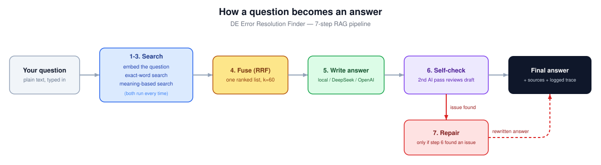

# DE IncidentIQ


## What this project is, in plain terms

This is a chatbot for data engineers. You type in a problem — an error message, a slow job, a
command that isn't working — and it gives you an answer.

The important difference from something like ChatGPT: before it writes an answer, it first looks
up real, previously-solved incidents from a private collection of **160 write-ups** (each one is a
real problem, its cause, and the fix that worked). It only writes an answer using facts from the
write-ups it found, and it tells you exactly which ones it used. It does not make things up from
general internet knowledge.

Think of it like a very well-read colleague who has personally read all 160 incident reports and,
instead of guessing from memory, always goes and re-reads the most relevant ones before answering
you — and then double-checks their own answer before saying it out loud.

Why that matters: a general chatbot answers from an average of everything it's ever read, can't
tell you where an answer came from, and sometimes invents technical settings that don't actually
exist. This system always shows its sources and refuses to invent settings that aren't in those
sources.

---

## 1. What this app can do

**Answers your question using only its own knowledge base**, and shows you exactly which write-ups
it used to get there — never a vague "based on general knowledge" answer.

**Searches two different ways at the same time, automatically, to find the best matches.** One
search method catches exact technical phrases (an exact setting name, a pasted error string); the
other catches questions phrased differently but meaning the same thing. The app always uses both
and combines the results, rather than picking one and risking a miss. This choice was tested and
measured, not just assumed — see [section 5](#5-evaluation), and the full explanation of how each
search method works is in [section 4](#4-how-it-works-under-the-hood).

**Picks the best search method available, automatically, and never breaks.** If the AI model needed
for the smarter, meaning-based search isn't running, the app silently falls back to exact-word
search only, so you always get an answer instead of an error message. You can also force a specific
search method for testing purposes. The app always tells you which method it actually used.

**Reviews its own answers before showing them to you.** A second, independent AI pass checks the
first draft for problems — unsupported claims, contradictions, fixes that don't actually match the
situation — and rewrites the answer if it finds any. You can turn this off if you'd rather see the
first draft.

**Lets you choose which AI model answers your question.** You can run a model on your own computer
for free and privately, or use a paid cloud AI service. You can switch between them from the app
itself at any time, without restarting anything.

**Keeps a full record of everything.** Every question asked, every answer given, how long it took,
what it cost, and every thumbs-up/down is saved to a local log file, viewable in the app's built-in
Monitoring page. If something about the logging itself fails, it fails quietly in the background —
it will never stop you from getting your answer.

**A simple two-page interface.** One page for asking questions and seeing answers (with a filter,
an adjustable number of search results, a toggle for the self-check step, and buttons to say
whether an answer was helpful). One page showing charts of how the system has been used and
performing over time.

---

## 2. The problem this solves

When something goes wrong with a data pipeline (the automated process that moves and processes
data — often using a tool called Spark), the person fixing it usually has to go searching for
help. That search is usually bad, for a few reasons:

- **Search engines and forum posts are noisy.** The top results are often for an old version of
  the tool, or describe a problem that *looks* the same on the surface but has a completely
  different cause. For example, an "out of memory" error can have at least six different root
  causes, and the error message alone doesn't tell you which one you have.
- **The real answer is often locked in someone's head or an old chat message.** The person who
  solved this exact problem last time may have left the team, or the message is buried and
  unsearchable.
- **The tempting quick fix often backfires.** Just increasing a memory setting and trying again
  sometimes works by luck, teaches nothing, and can make some problems worse.
- **General AI chatbots sound confident but can be wrong in ways that are hard to catch.** They
  can invent settings that don't exist, and they don't know when a fix that normally works is a
  bad idea given your specific situation.

**What this system does differently.** It stands a curated, fact-checked collection of real
incidents between your question and the AI model's answer:

1. **Every entry is a real, diagnosed case**, not a random forum post — what happened, why it
   happened, and what fixed it.
2. **It searches two different ways at once and combines the results.** Some questions contain
   exact technical phrases (an exact setting name, a full command that was pasted in); other
   questions are phrased in plain words that mean the same thing as an entry without using the
   same words. One search method is good at exact-phrase matching, the other is good at
   meaning-based matching. This system uses both every time and blends the results, instead of
   picking one and missing what the other would have found.
3. **The answer is checked twice before you see it.** First, the AI is told it may only use facts
   that actually appear in the incidents it retrieved. Then a second, independent pass reviews the
   draft answer looking for contradictions or unsupported claims, and rewrites it if it finds any.
4. **Answers are structured like a troubleshooting runbook**: likely cause, concrete numbered
   steps, how to check that the fix worked, and honest caveats about what the system doesn't know.
5. **Everything is logged**, so you (or anyone reviewing this project) can see search quality,
   response time, cost, and whether people found the answers helpful, all in a built-in dashboard.

---

## 3. The knowledge base (what the system actually knows)

The system's knowledge comes from **160 write-ups**, built from two different sources.

### Source A — 110 real-world incident write-ups

Long-form descriptions of real production problems, gathered from public blog posts and online
research, one write-up per kind of problem:

| Category | What it covers |
|---|---|
| `data-pipeline-failures` | jobs dying, retries, partial data loads |
| `performance-latency` | slow processing, missed deadlines |
| `streaming-kafka` | live-data pipelines falling behind or losing messages |
| `data-quality` | silent data corruption, duplicate records, broken trust in the numbers |
| `cloud-cost-resources` | runaway cloud bills, wasted resources |
| `orchestration-scheduling` | scheduled jobs failing to run in the right order |
| `schema-evolution` | a change to data's structure breaking something downstream |
| `backfills-reprocessing` | safely re-running historical data |
| `security-access` | access and permissions incidents |
| `stakeholder-process` | the people and communication side of an incident |

Each entry records: what the problem was, which category it belongs to, and how it was resolved.

### Source B — 50 written examples of common configuration mistakes

Source A is strong on "here's what happened and why," but light on something engineers very often
paste in directly: a full technical command that isn't working. Source B fills that gap with 50
realistic examples covering the most common configuration mistakes (things like: running out of
memory, uneven workload distribution, too many small output files, and similar setup problems).
These were written with the help of AI plus the project author's own technical knowledge, not
copied from a real incident.

Each entry, again, records the problem, its category, and the resolution.

### How the raw write-ups become a searchable knowledge base

Every entry — from either source — starts out as five simple pieces of information: an ID, a
title, a category, a description of the problem, and the resolution. This raw, plain version lives
in one file, `data/all_documents.json`, and is the permanent master copy of the knowledge base.
Adding a new issue in the future means adding a new entry here, in that same simple format — see
[Adding new issues](#adding-new-issues--rebuilding-the-corpus) in section 6.

From there, an automated step reads each entry and asks an AI model to fill in extra structured
detail: a short summary, which system component it relates to, what type of error it is, and a
handful of descriptive tags. That same step also generates an **embedding** for each write-up —
a list of 1024 numbers that captures the *meaning* of the text, not just its exact words, produced
by a dedicated embedding model called **Qwen3-Embedding-0.6B** (0.6-billion-parameter model, run
locally). Two write-ups that describe the same underlying problem in completely different words end
up with similar embeddings, which is what makes meaning-based search possible — this is explained
in more depth, with why it matters, in [section 4](#4-how-it-works-under-the-hood). That richer,
enriched version (metadata + embeddings) is saved separately from the plain master file, which is
never overwritten.

**Files that make up the knowledge base** (all inside the `data/` folder):

| File | What it holds |
|---|---|
| `all_documents.json` | The 160 raw write-ups — the permanent master copy |
| `enriched_documents.json` | The same 160 write-ups, plus the AI-added detail and embeddings |
| `embeddings.npy` | The embeddings themselves — a table of 160 rows x 1024 numbers |
| `embeddings_ids.json` | A lookup list matching each embedding back to the right write-up |
| `knowledge_base.duckdb` | The write-ups loaded into an actual lightweight database, rebuilt automatically whenever the enriched file changes |
| `rag_traces.duckdb` | A log of every question asked and every thumbs-up/down given, growing over time as the app is used |

Details about how the system is *tested* — separate datasets used only for measuring accuracy, not
for running the app — are documented in [`retrivalLLMEvalTest.md`](retrivalLLMEvalTest.md).

---

## 4. How it works, under the hood

This section explains the technical pieces in plain language. Feel free to skip it if you just
want to use the app — jump to [section 6](#6-setup-and-how-to-run).

### What is an embedding, and why does this app use one?

An embedding is what turns a piece of text into a list of numbers (1024 of them, in this project)
that represents its *meaning* rather than its exact wording. Two sentences that mean almost the
same thing — even if they don't share a single word — end up with very similar number lists. This
is the trick that lets the app find a write-up about "executors dying during a wide join" when you
ask about "workers running out of RAM while joining big tables," even though neither sentence uses
the other's exact words.

This project uses a specific, dedicated embedding model called **Qwen3-Embedding-0.6B** to produce
these numbers, run as its own small local server, separately from whichever AI model is chosen to
actually *write* the answer (see "Provider switching" further down) — the embedding model doesn't
change based on that choice. It runs the same way regardless of whether you're using a free local
model or a paid cloud service to generate answers.

Every write-up in the knowledge base gets its embedding computed once, ahead of time, and stored in
`data/embeddings.npy` (see the files table in [section 3](#3-the-knowledge-base-what-the-system-actually-knows)).
Every time you ask a question, that question also gets turned into an embedding on the spot, and
the app compares it against all 160 stored embeddings to find the closest matches — this is what
"meaning-based search" means everywhere else in this document.

### Getting the write-ups ready (done ahead of time, not while you're waiting for an answer)

New write-ups are added to the plain master file, then go through two automated steps before the
app can use them:

```
                                            data/all_documents.json  (plain master copy)
                                                         │
                                       add AI-generated detail + embeddings
                                       (only processes new/changed entries, so this is
                                        safe and cheap to re-run after small additions)
                                                         │
                                                         ▼
                    enriched_documents.json + embeddings.npy + embeddings_ids.json
                                                         │
                                   load into a real lightweight database
                                     (only re-loads if something changed)
                                                         │
                                                         ▼
                                              knowledge_base.duckdb
                                                         │
                                    build the two search tools the app uses
                                                         ▼
                             an exact-word search tool + a meaning-based search tool
```

Both the live app and every accuracy test build these two search tools the exact same way, so
testing and real usage can never quietly drift apart.

### What happens when you ask a question (7 steps)



```
  your question
     │
     ├─[1] turn the question into an embedding (skipped if only exact-word search is used)
     ├─[2] exact-word search .......... finds write-ups sharing words/phrases with your question
     ├─[3] meaning-based search ....... compares embeddings, finds write-ups that mean the same thing
     ├─[4] combine both search results into one ranked list
     ├─[5] write an answer ............ using only facts from the top-matching write-ups
     ├─[6] self-check ................. a second, independent AI pass reviews the draft answer
     └─[7] rewrite (only if needed) ... one revision, only if step 6 found a real problem
     │
     ▼
  your answer + the write-ups it used + a record of the whole process, saved for later review
```

A quick note on step 4, "combine both search results": exact-word search is good at catching a
pasted command or an exact technical term; meaning-based search (using the embeddings described
above) is good at catching a question phrased in different words than the write-up uses. Rather
than picking one, the system runs both every time and blends their two ranked lists into one, so a
good match found by either method survives into the final answer.

A quick note on step 2's boosts: when doing the exact-word search, a match in the title counts for
more than a match buried in the body text, on the reasoning that a word appearing in the title is a
much stronger signal of relevance than the same word appearing once in a long paragraph. These
weightings were originally set using judgment about what "should" matter more, then confirmed by a
1,024-combination grid search (`evaluation/1_grid_search_evaluation.py`) that tried every
combination of field weights and measured each one's Hit Rate/MRR — the values already in use came
out as the best of everything tried. See [`retrivalLLMEvalTest.md`](retrivalLLMEvalTest.md) for the
full comparison.

### Choosing which AI model writes the answer

Whichever AI model actually *writes* the answer (step 5 above) is chosen independently of the
embedding model described earlier — you can run a free local model or use a paid cloud service, and
either way, the same local Qwen3-Embedding-0.6B model still handles the meaning-based search side.

There are three options, all fully supported and switchable at any time from the app's sidebar:

| Option | What it is | Cost | What it needs |
|---|---|---|---|
| **Local** | A model (Qwen3.5-9B) running on your own computer | Free | A capable graphics card, and the local model server started (see section 6) |
| **DeepSeek** | DeepSeek's cloud API (`deepseek-v4-flash`) | Small per-query cost | A DeepSeek API key |
| **OpenAI (ChatGPT)** | OpenAI's cloud API (`gpt-4o-mini` by default) | Small per-query cost | An OpenAI API key |

**What decides which one is used by default, and why:** the setting `LLM_PROVIDER` in your `.env`
file (`local`, `deepseek`, or `openai`) picks the option that's pre-selected when the app starts.

- Running the app directly on your own computer (`uv run streamlit run app.py`), this defaults to
  `local` if you don't set it at all — reasonable, since a local model server is easy to run
  alongside the app on your own machine.
- Running inside Docker, this defaults to `deepseek` instead if you don't set it — because a
  Docker container has no graphics card of its own to run a local model on.

Either way, this is only the *starting* selection — you (or anyone using the app) can switch to any
of the three options from the sidebar at any time the app is running, with no restart needed, as
long as the relevant API key has already been set up (for DeepSeek/OpenAI) or the local model
server is already running (for Local). If you pick an option whose key isn't set up, the app shows a
clear warning instead of crashing.

The same three options are available when running things from the command line, too — for example
`uv run python my_assistant/rag.py --openai "..."` or
`uv run python evaluation/3_llm_prompt_judge_evaluation.py --openai` force that specific option for a
single run, overriding whatever `.env` says; leaving the flag off follows `.env`'s `LLM_PROVIDER` as
usual. Full setup steps for each option (getting an API key, setting it safely, starting a local
model server) are in [`nonDockerRun.md`](nonDockerRun.md) and
[`DockerDeployment.md`](DockerDeployment.md).

---

## 5. Evaluation

How well this system actually works was measured and tested — search accuracy and answer quality —
using separate test data written for that purpose (never used to build the answers themselves).
Full details, methodology, and results are written up in
[`retrivalLLMEvalTest.md`](retrivalLLMEvalTest.md). The headline numbers:

**Retrieval — which search method finds the right write-up most often?** Three approaches
(exact-word, meaning-based, and the two combined) were measured on two independent question sets —
103 fixed eval questions (doc-level Hit Rate@5/MRR@5) and 45 separately hand-written questions
(category-level Hit Rate@5) — and the field weights behind exact-word search were further tuned
with a 1,024-combination grid search.

| Search method | Doc-level Hit Rate@5 / MRR@5 (103 q) | Category-level Hit Rate@5 (45 q) |
|---|---|---|
| Exact-word only | 0.951 / 0.907 | 0.844 |
| Meaning-based only | 0.961 / 0.916 | 0.889 |
| **Combined (used in production)** | **0.990 / 0.944** | **0.956** |

**Answer quality — does the wording of the answer matter?** 4 meaningfully different
answer-writing personas were compared on 30 questions each, with a second AI model independently
scoring every answer 1-5 on groundedness (backed by the retrieved write-ups) and relevance
(actually answers the question).

| Persona | Groundedness | Relevance |
|---|---|---|
| SME (concise, fixed fix) | 4.93 | 5.00 |
| DE expert (with example) | 4.87 | 5.00 |
| Error-resolution (terse) | 4.60 | 4.80 |
| **Structured (used in production)** | **4.97** | **5.00** |

**Best practices checklist** (the course explicitly calls these out as extra-credit techniques):

| Technique | Status |
|---|---|
| Hybrid search (exact-word + meaning-based) | **Implemented and measured** — see the retrieval table above |
| Document re-ranking (a dedicated re-ranking/cross-encoder pass) | Not implemented. RRF (Reciprocal Rank Fusion) is used to merge the two search legs into one ranked list, but that's rank aggregation, not a separate re-ranking model |
| Query rewriting (reformulating the user's question before search) | Not implemented — the question is searched as typed |

Two things built into this project that go beyond the course rubric: an out-of-scope gate that
skips writing an answer entirely when nothing genuinely relevant is retrieved (rather than letting
the model guess), and a self-check/repair pass where a second AI call reviews the draft answer for
unsupported claims or contradictions before it's shown to you (see `my_assistant/rag.py`'s
`self_check` step).

---

## 6. Setup and how to run

Full step-by-step instructions are in:

- [`nonDockerRun.md`](nonDockerRun.md) — running it directly on your own computer
- [`DockerDeployment.md`](DockerDeployment.md) — running it inside Docker (a way of packaging the
  whole app so it runs the same way on any computer, without you needing to install everything
  yourself)

A quick summary of what you'll need:

- **Python** (the programming language this is built in) and a tool called **uv** that installs
  everything else automatically.
- **One of three ways to get answers written** — see the table in
  [section 4](#4-how-it-works-under-the-hood): a **DeepSeek API key**, an **OpenAI API key**, or a
  computer with a capable graphics card to run a model yourself for free. Any one is enough.
- Either way, a locally running **Qwen3-Embedding-0.6B** server is what powers meaning-based search
  (see [section 4](#4-how-it-works-under-the-hood)) — the app still works without it, just falling
  back to exact-word search only.
- If you plan to add brand-new issues to the knowledge base yourself, you'll also need one of the
  above (local model or a key) so the system can generate the extra AI detail for your new entries.
  You don't need this just to use the app with the 160 write-ups already included.

Any real, secret API keys are never stored in a project file — they're set as environment
variables on your own computer only. Both setup guides above walk through exactly how to do this,
step by step.

### Adding new issues / rebuilding the corpus

New write-ups are added directly to `data/all_documents.json`, in the same simple format as the
existing 160: an ID, a title, a category, the problem, and the resolution. After adding one or
more, run the two preparation steps described in section 4 (adding AI detail and embeddings, then
loading into the database) so the app picks them up — the exact commands for this are in
[`nonDockerRun.md`](nonDockerRun.md). Both steps are safe to re-run at any time: they only do work
on entries that are new or changed, so re-running them after a small addition doesn't reprocess
everything from scratch.

---

## 7. Project structure

`app.py`, at the top level, is the only file meant to be run directly (outside of Docker). All of
the underlying logic lives in the `my_assistant/` folder, so the top level of the project only
contains "the thing you run" plus setup/configuration files.

```
capeStone-DE-error-resolution-finder/
├── README.md                          this file
├── DockerDeployment.md                step-by-step guide for running it in Docker
├── nonDockerRun.md                    step-by-step guide for running it directly
├── retrivalLLMEvalTest.md             what was tested and the results (plain-language)
├── pyproject.toml / uv.lock           dependency list, locked to exact versions
├── .env.example                       template for non-secret settings (copy to .env)
├── Dockerfile / docker-compose.yml    files that package the app for Docker
├── app.py                             the app itself — the only file you run directly
├── main.py / __init__.py              package-root marker files (not run directly)
│
├── my_assistant/                      the core logic
│   ├── rag.py                         the question-answering pipeline itself
│   ├── ingest.py                      builds the two search tools
│   └── kb_ingest.py                   loads the write-ups into the lightweight database
│
├── data_pipeline/
│   └── enrich_documents.py            adds AI-generated detail + embeddings to any new write-ups
│
├── evaluation/                        every accuracy/quality test, run in numbered order,
│   │                                   each script writing its own results_N_*.json file
│   ├── 1_grid_search_evaluation.py     step 1: search-weight tuning (produces results_1_...)
│   ├── 2_retrieval_evaluation.py       step 2: search accuracy (produces results_2_...)
│   ├── 3_llm_prompt_judge_evaluation.py  step 3: answer-prompt A/B (produces results_3_...)
│   ├── _eval_utils.py                  shared helpers (not an evaluation itself)
│   ├── results_1/2/3_*.json           saved results from the last run of each step
│   ├── test_questions.md              50 hand-written test questions (source for step 2's
│   │                                   CATEGORY_QUESTIONS list)
│   └── test_questions_for_eval.json   103 fixed (question, correct write-up) pairs used by
│                                       steps 1-3 — generated once, reused as-is
│
└── data/                              the knowledge base files — see the table in section 3
```

**Main building blocks this project relies on:** a lightweight exact-word search library, a
numbers/math library for the meaning-based search over embeddings, a shared client library for
talking to AI models (whether local or cloud), a lightweight database tool, and the Streamlit
framework that the app's interface is built on.

---

## 8. Known limitations

Limitations specific to how accuracy was *measured* are documented in
[`retrivalLLMEvalTest.md`](retrivalLLMEvalTest.md), not here.

Engineering limitations of the system itself:

- **Everything runs in one process, in memory.** The table of embeddings used for meaning-based
  search is rebuilt every time the app starts. This is fine at 160 write-ups; a much larger
  knowledge base would need a proper database built for this kind of search.
- **Setup instructions assume Windows.** The commands shown are for Windows' PowerShell; the
  underlying program itself would run the same way on any operating system.
- **Running locally still needs a model running on your own computer, even inside Docker.** If you
  choose to run the AI model locally rather than through a paid service, Docker reaches it on your
  host computer — the local model itself isn't something Docker manages for you. The same applies
  to the local Qwen3-Embedding-0.6B server that powers meaning-based search.

## Containerization

The project includes a `Dockerfile` and `docker-compose.yml` that package the whole app so it can
be built and run consistently on any computer, without installing Python or any dependencies by
hand. Full step-by-step setup instructions are in [`DockerDeployment.md`](DockerDeployment.md).

In short: you choose which AI provider to use in a small settings file, set any real API keys as
environment variables on your computer (never inside the project files), and then a single command
builds and starts the whole app. Your data is kept on your own computer even though the app runs
inside a container, so nothing is lost when the container restarts.
